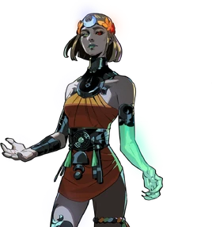

> 克洛诺斯必死无疑！

冥界公主墨利诺厄是哈迪斯和珀耳塞福涅的女儿，扎格列欧斯的妹妹，也是《哈迪斯2》的主角。

墨利诺厄是一位与鬼魂和噩梦相关的冥界女神。在《哈迪斯2》的故事发生之前，墨利诺厄一家在冥界过着幸福的生活。然而，泰坦神克洛诺斯从塔尔塔罗斯深渊的囚牢中逃脱，并控制了冥界。奉父亲之命，赫卡忒将墨利诺厄带走，并训练她成为一名泰坦杀手。

如今，墨利诺厄的任务是下到冥界，击败克洛诺斯。

## 个性与特征

与叛逆不羁的哥哥扎格不同，墨利诺厄性格严肃自律。这得益于她多年来在赫卡忒的指导下接受的艰苦训练，最终成为一名完美的泰坦杀手。尽管失去了家人和家园，她也并未因此变得怨恨。墨利诺厄喜欢一切井然有序，厌恶混乱。她会因为朵拉弄丢哪怕一个药瓶而责备她，也会因为厄里斯在她面前乱扔垃圾而感到恼火，暗示厄里斯可能患有某种强迫症。尽管她自律，但她也喜欢收集一些小玩意儿，比如冥界之子（Chthonic Chid）的雕像，这些雕像代表着冥界之子（Chthonic）的成员。她会小心翼翼地整理和保存每一件藏品，相信它们会随着时间的推移而变得珍贵。当朵拉指出这些雕像只是儿童玩具时，她会有些恼火。

墨利诺厄在旅途中通常对遇到的每个人都友善而尊重，也希望得到同样的礼遇。她称呼所有人时都使用敬语，无论对方是地位崇高的神祇还是地位卑微的神灵。她也是一位狂热的动物爱好者，尽可能地抚摸动物，并将自己的成功或失败倾诉给她的第一位动物伙伴弗里诺斯。她与生灵之间有着一种神奇的吸引力，以至于它们都心甘情愿地成为她的动物伙伴。对于朋友和亲密伙伴，只要他们需要帮助，她都会毫不犹豫地伸出援手。尽管心地善良，但梅利诺厄对她视为敌人的人却极其记仇，尤其是对克洛诺斯及其仆从。​​

谈到凡人的生命，墨利诺厄坦言她对他们的事务漠不关心，她杀死克洛诺斯的动机更多是为了报复他夺走的一切，而非出于拯救人类的崇高愿望。相反，尽管墨利诺厄生前对人类漠不关心，但她似乎对亡灵非常保护。在她第一次踏上地表之旅时，她对克洛诺斯竟敢强行征召亡灵为他而战感到震惊和厌恶，因为她认为亡灵都应该在冥界安息。

她一心只想达成目标，这固然令人钦佩，但也存在一些明显的弊端。墨利诺厄几乎从出生起就被赫卡忒从身心两方面塑造成完美的泰坦杀手，只要能杀死克洛诺斯，她便毫不在乎自己的安危，在奔跑中展现出无畏和鲁莽。这种执着也意味着，她从未停下来思考过，如果真的实现了目标，接下来该做什么。相反，每当她任务失败时，她就会陷入深深的抑郁和压力之中，觉得自己辜负了预言——而她认为预言是她存在的唯一意义。游戏的很大一部分内容就是她踏上自我发现之旅，努力弄清楚自己是谁，以及自己真正想要什么、需要什么。

## 外形

和她的哥哥扎格一样，墨利诺厄也患有异色症 —— 一只眼睛像父亲一样是红色的，另一只眼睛像母亲一样是绿色的，只是颜色和扎格的正好相反。左臂散发着幽幽的绿光，隐约可见下面的骨骼，这是她在帮助朋友伊卡洛斯时，因魔法失误造成的。她有着和母亲一样的麦金色头发，但扎格继承了母亲的尖刺状头发，而墨利诺厄的头发则像父亲一样，自然垂落成柔软的卷发，就像哈迪斯长发时的样子。回忆片段显示她的头发更长更卷，在温泉中，她的头发看起来更加浓密蓬松。她的皮肤像扎格一样苍白，但她更纤细，肌肉也更少。和她的父亲和哥哥一样，她赤裸的双脚散发着温暖的气息。她身材娇小，手臂线条优美，腰肢纤细，胸部较小，臀部相对较宽。

## 服装
墨利诺厄头上戴着一顶月桂花环，戴在头上如同余烬般闪耀，与她哥哥的花环十分相似。她的刘海中分，露出额头上一弯向上弯起的月牙。她身着一件藏红花色的短裙，脖子上戴着颈托，四肢上装饰着金属饰品，右腿上是月牙形的。左腿上则戴着一条橙、绿、蓝、黑相间的编织绳，与(银姐妹会?)其他成员的服饰颜色相呼应。

## 冥界事件

在冥界事件之后，哈迪斯和珀耳塞福涅迎来了他们的第二个孩子墨利诺厄。为了纪念这个喜庆的日子，他们委托人绘制了一幅画，画中描绘了他们家庭的新成员。然而，好景不长，时间之神克洛诺斯从塔尔塔罗斯逃脱，并将墨利诺厄一家以及冥界的其他成员囚禁在塔尔塔罗斯深处。在哈迪斯的命令下，赫卡忒带着墨利诺厄、那幅未完成的家庭画作以及当时在场的(许普诺斯?)逃走了。赫卡忒带着孩子逃到了三岔路口，让她远离了克洛诺斯的魔爪。

在此期间，命运三女神预言冥王哈迪斯的第二个孩子将会推翻泰坦神祇。因此，赫卡忒选择不与墨利诺厄在奥林匹斯山上的家人联系。基于这一预言，赫卡忒决定独自抚养墨利诺厄，并亲自训练她，让她有朝一日能够击败克洛诺斯，实现预言。墨利诺厄在三岔路口接受了严格的训练，力求达到身心完美。她始终感觉自己缺失了什么，只能断断续续地回忆起家人，并做一些关于家人的模糊梦境；最终，她只认识两位奥林匹斯山的亲人：阿尔忒弥斯和赫尔墨斯。

在她年长许多的时候，她为了帮助朋友伊卡洛斯，用赫卡忒的坩埚救了他，结果失去了左臂。

墨利诺厄的训练终于结束后，她踏上了征程，试图打败克洛诺斯。阿尔忒弥斯决定将墨利诺厄及其挑战克洛诺斯的计划告知阿波罗，阿波罗又将消息传给了其他奥林匹斯神祇。墨利诺厄最终与她在奥林匹斯山上的家人重逢，他们赐予她恩惠，帮助她完成旅程。

## 暗影之书

<R2Image src="/dark_book.png"/>

我怎么知道？因为你在想，如果你从未出生，这一切或许都不会发生？而你的使命却是好好生活，超越过去。

你为何而战？你想证明什么？即便命运眷顾你最终获胜，那又如何？在你四处奔波的时候，不妨好好想想这些问题。

## 杂项

+ 由于珀耳塞福涅的父亲是凡人，所以墨利诺厄有四分之三的神性，四分之一的凡人血统。

+ 在希腊神话中，墨利诺厄是宙斯和珀耳塞福涅的女儿，或者在某些版本中，是哈迪斯和珀耳塞福涅的女儿。这是因为在俄耳甫斯教中，宙斯和哈迪斯一度被视为同一神祇。此外，根据俄耳甫斯教的说法，墨利诺厄是在科库托斯河畔受孕并出生的，当时宙斯伪装成哈迪斯，欺骗了珀耳塞福涅，使她怀孕。

+ 在希腊神话中，墨利诺厄（Melinoë）以诸多身份而闻名。她是幽灵、不安灵魂、祭祀亡灵、噩梦、恐惧和疯狂的女神。她游荡于人间，身边簇拥着幽灵，将这一切带给凡人。然而，她也被视为亡灵的守护神，许多人敬仰她、崇拜她，希望她能凭借与亡灵沟通的能力，帮助他们与逝去的亲人团聚。她还拥有施展幻术的神力。

+ 在游戏中，墨利诺厄与亡灵之间明显的联系，以及她对亡灵的保护和她能够长时间在地表上行走的能力，可能暗示了她在希腊神话中作为引渡亡灵的角色。

+ 在希腊神话中，墨利诺厄一半身体是黑色的，另一半是白色的。这或许可以解释为什么游戏中墨利诺厄的一只手臂是幽灵般的绿色，既呼应了她作为幽灵女神的身份，也呼应了神话中她身体一半是黑色的形象。

+ Melinoë 的名字意思是“像榅桲一样的颜色”，榅桲是一种黄绿色，与疾病或死亡时的苍白有关。

+ 在一首献给墨利诺厄的俄耳甫斯赞歌中，她被描述为“身披藏红花色斗篷”。这很可能启​​发了游戏中她的服装配色方案。

+ 在希腊神话中，墨利诺厄经常与魔法和巫术女神赫卡忒联系在一起。这或许可以解释为什么在游戏中墨利诺厄是赫卡忒的学生。

+ 在希腊神话中，墨利诺厄本人也以巫术闻名，因此其他角色称她为女巫。

+ Melinoë 的整体外观似乎深受 2000 年代初期和 2020 年代哥特朋克亚文化的影响。

+ 墨利诺厄的动物伙伴弗里诺斯是一只青蛙，这很可能是因为青蛙是赫卡忒的圣兽之一；然而，墨利诺厄似乎才是弗里诺斯的真正主人。在希腊神话中，她出生在河边，所以选择这只青蛙作为她的伙伴也可能与此有关。

+ 在与阿拉克涅的对话中，墨利诺厄表示她完全没有食欲，并且在同一次对话中，她特别提到自己不喜欢吃动物或昆虫，暗示她是一名素食主义者。

+ 在接受Game Informer采访时，Greg Kasavin声称Melinoë会听“斯堪的纳维亚-欧洲交响金属乐”或“90年代工业音乐”（据Darren Korb所说）。Kasavin推测她会是The Smiths的歌迷。